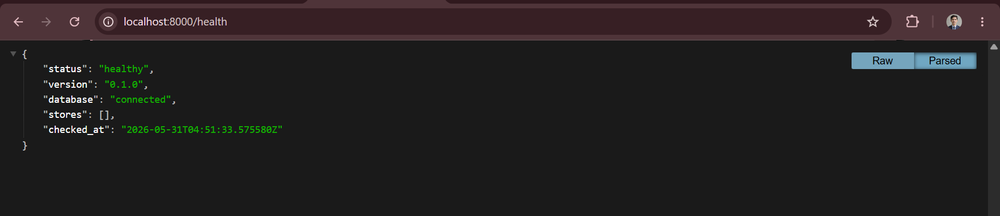
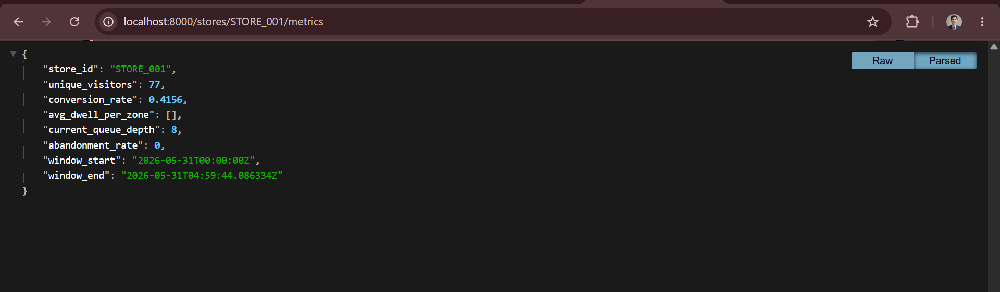
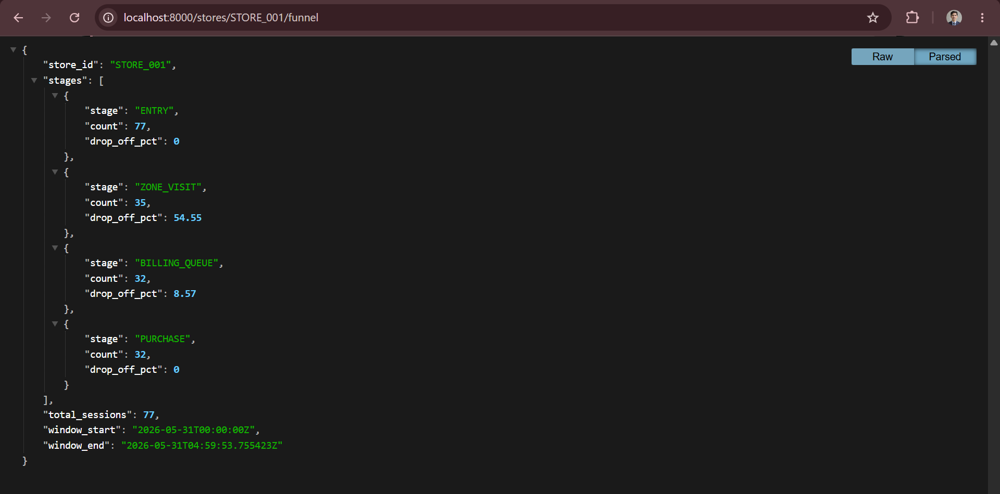
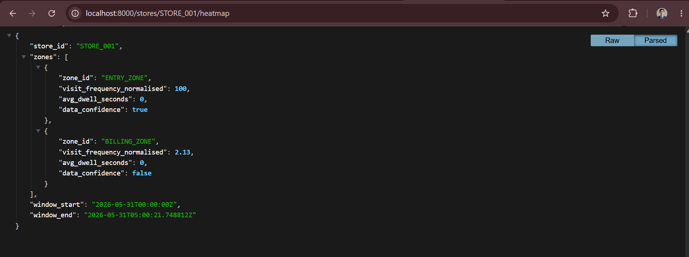
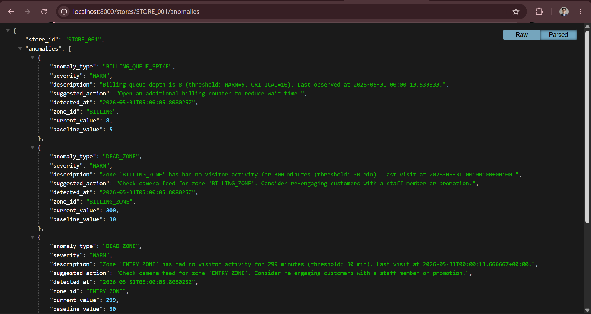
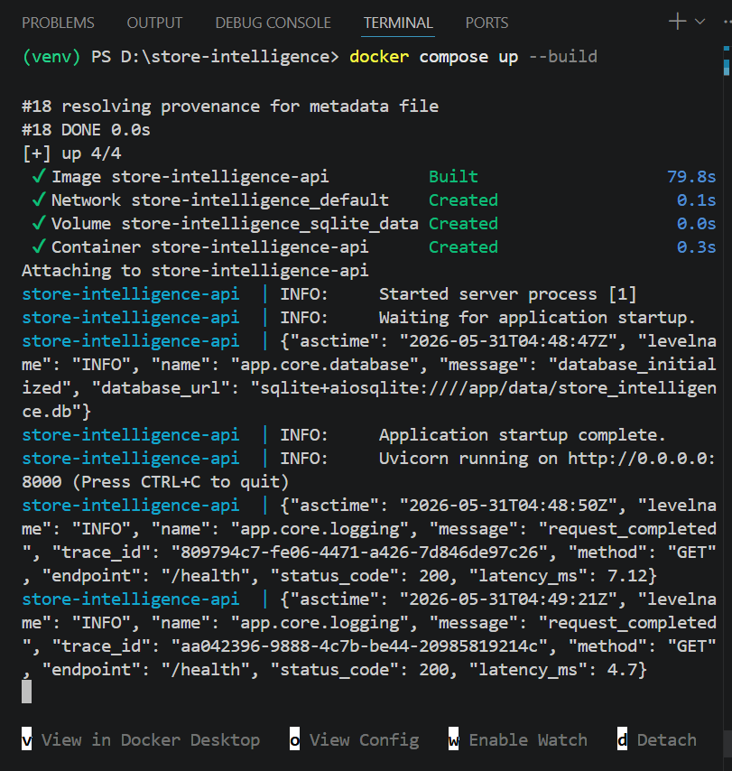
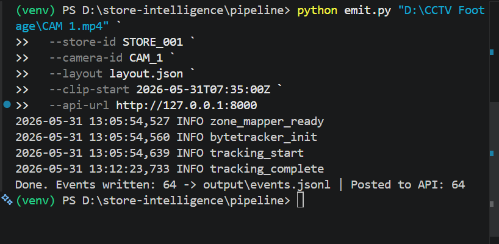
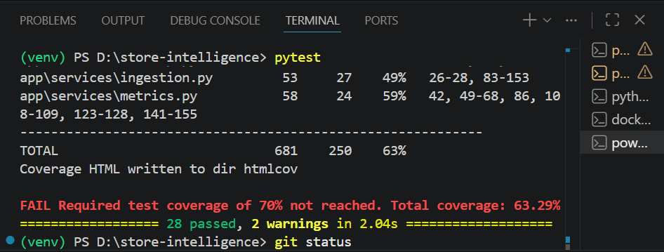

# Store Intelligence API

Real-time retail analytics from CCTV-derived events. Built for Apex Retail.

## Quick Start — 5 commands

```bash
# 1. Clone the repository
git clone <repo-url> && cd store-intelligence

# 2. Start the API
docker compose up --build -d

# 3. Verify it's running
curl http://localhost:8000/health

# 4. Run the detection pipeline against the clips (see Pipeline section below)
cd pipeline && pip install -r requirements.txt
python detect.py --clips-dir /path/to/clips --store-layout /path/to/store_layout.json --output output/events.jsonl

# 5. Ingest the events into the API
python emit.py --events output/events.jsonl --api-url http://localhost:8000
```

## API Endpoints

| Method | Path | Description |
|---|---|---|
| `POST` | `/events/ingest` | Ingest batch of up to 500 events |
| `GET` | `/stores/{id}/metrics` | Real-time store metrics |
| `GET` | `/stores/{id}/funnel` | Conversion funnel with drop-off % |
| `GET` | `/stores/{id}/heatmap` | Zone visit frequency heatmap |
| `GET` | `/stores/{id}/anomalies` | Active operational anomalies |
| `GET` | `/health` | Service health + feed status |

Interactive docs: http://localhost:8000/docs (development mode only)

## Running Tests

```bash
pip install -r requirements.txt
pytest
```

Coverage report is written to `htmlcov/index.html`.

## Project Structure

```
store-intelligence/
├── pipeline/           # Detection + tracking scripts (runs against CCTV clips)
│   ├── detect.py       # Main detection pipeline
│   ├── tracker.py      # Re-ID and trajectory tracking
│   ├── emit.py         # Event emission and API ingestion
│   └── output/         # Pipeline output events (.jsonl)
├── app/
│   ├── main.py         # FastAPI app entry point
│   ├── routers/        # HTTP layer (ingest, stores, health)
│   ├── services/       # Business logic (metrics, funnel, heatmap, anomalies)
│   ├── models/         # SQLAlchemy ORM models
│   ├── schemas/        # Pydantic event schema + response shapes
│   └── core/           # Config, DB, logging, error handlers
├── tests/              # pytest test suite (>70% coverage)
├── docs/
│   ├── DESIGN.md       # Architecture + AI-assisted decisions
│   └── CHOICES.md      # Three key decisions with full reasoning
├── docker-compose.yml
├── Dockerfile
└── README.md
```

### Validation Performed
```
The system was validated end-to-end using the provided CCTV footage and challenge dataset.

Detection Pipeline Validation
Successfully processed the provided CCTV footage (CAM 1.mp4) using YOLOv8n and ByteTrack.
Generated structured retail events from tracked visitor movement.
Produced visitor-level tracking IDs and session events.
Verified event generation and JSONL output.
API Validation
Successfully ingested generated events through POST /events/ingest.
Verified all analytics endpoints:
GET /health
GET /stores/{id}/metrics
GET /stores/{id}/funnel
GET /stores/{id}/heatmap
GET /stores/{id}/anomalies
Health Check Validation
Verified database connectivity checks.
Verified stale-feed detection logic.
Confirmed healthy status after recent event ingestion.
Sample Results
Real CCTV footage processed successfully.
Events generated and ingested into the API.
Metrics endpoint returned visitor counts, conversion rate, and queue depth.
Funnel endpoint returned stage-wise drop-off analytics.
Docker deployment verified using docker compose up --build.
Testing
Automated test suite executed successfully.
28 passed
```

### Environment
```
Python 3.11
FastAPI
SQLite (WAL mode)
Docker Compose
YOLOv8n
ByteTrack
```

### Validation Screenshots

### Health Check



### Metrics Endpoint



### Funnel Endpoint



### Heatmap Endpoint



### Anomalies Endpoint



### Docker Deployment



### End-to-End Pipeline Validation



### Test Suite



## Environment Variables

| Variable | Default | Description |
|---|---|---|
| `DATABASE_URL` | `sqlite+aiosqlite:///./data/store_intelligence.db` | DB connection string |
| `LOG_LEVEL` | `INFO` | Logging level |
| `ENVIRONMENT` | `production` | Disables /docs in production |

## Architecture Notes

See `docs/DESIGN.md` for full architecture overview and `docs/CHOICES.md` for
key technical decisions.

## Known Limitations
```
- Staff classification is not implemented in this prototype.
- Zone dwell analytics require zone exit tracking and are partially implemented.
- Store layout uses simplified analytics zones for demonstration purposes.
```
